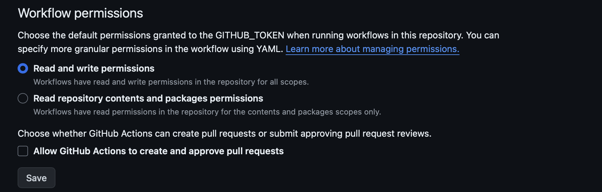

# Overview

`d33pster/python-project-structure` is a github action designed to check and fix the dir-structure of a repository for python projects in accordance with [`PYPI`](https://pypi.org).

> **`current active version: v3`**

## README

* Before you can use this, go to `Repository Setting > Actions > General` and allow Read and Write Permissions.

  

  and hit save.

* **[OPTIONAL]** After altering the setting, Create a `Personal Access Token` with `repo` access. To create one, head to `Settings (GitHub settings) > Developer Settings > Personal Access Token > Tokens (classic) > Generate New Token > Generate New Token (classic)` and choose a name, expiration data and tick `repo` and hit create.

  Copy this token and save it in a safe place. Also, head to `Repository Settings > secrets and variables > Actions > New Repository Secret` and choose a name of your choice, say, `GITHUB_TOKEN` and paste the token in the area provided and hit save.

* After that, write a workflow file `filename.yml` or `filename.yaml`. Replace `filename` with your desired filename.

  ```yaml
  # This workflow file will be run on every push to keep track of dir-structure 
  # or can be created at the start of the project to create a demo dir-structure for
  # python projects in accordance with PYPI.

  name: # add a name for your workflow.

  on:
    push:
        branches: ["main"]
  
  permissions: write-all # or commits read and write permissions.

  jobs:
    structure:
        runs-on: ubuntu-latest

        steps:
        - uses: d33pster/python-project-structure@v3
          with:
            GH_API_TOKEN: ${{ secrets.GITHUB_TOKEN }} # optional
            # you can change this to any name you chose earlier.
            # don't change GH_API_TOKEN. Leave it as it is.
  ```

  Once, you create this file and then add, commit and push to the repository, it will automatically check and update any file missing.

## Changes

* If not present, `src/__init__.py` will be created in the repository. If any file named `src` is present, it will be renamed to `src.file` and then `src/__init__.py` will be created.

* If not present, `pyproject.toml` will be created with default values. If any directory is present named the same, it will be renamed to `pyproject.toml.dir` and then `pyproject.toml` will be created.

* If not present, `tests/` will be created in the repository. If any file named `tests` is present, it will be renamed to `tests.file` and then `tests/` will be created.

* If present `requirements.txt` or `requirements` (case in-sensitive) file is present. All its contents will be transfered to `pyproject.toml` and the requirements will be deleted.

## Issues

* Any Issues found should be added [here](https://github.com/d33pster/python-project-structure/issues).

## Pull Requests

* Pull Requests are welcome and encouraged.
